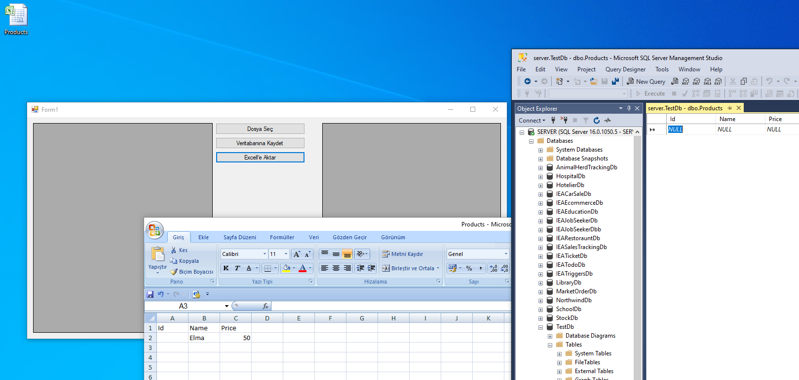

# excell-read-import-to-sql-and-import-to-excel

 
# Excel Veri Aktarım Projesi

Bu proje, C# ve .NET kullanarak bir Windows Forms uygulaması geliştirmek için örnek bir başlangıç noktasıdır. Bu uygulama, Excel dosyasındaki verileri alır, bu verileri görüntüler ve ayrıca bu verileri bir SQL Server veritabanına aktarabilir.

## Başlangıç

Bu projeyi yerel makinenizde çalıştırmak için aşağıdaki adımları takip edebilirsiniz.

### Gereksinimler

Projenin çalışması için aşağıdaki gereksinimlere ihtiyacınız olacaktır:

- Visual Studio (örneğin, Visual Studio 2019)
- .NET Framework
- SQL Server (isteğe bağlı)

### Kurulum

1. Bu projeyi GitHub'dan indirin veya klonlayın.

2. Visual Studio'da projeyi açın.

3. Projeyi derleyin ve çalıştırın.

### Kullanım

Proje, bir Excel dosyasını açmanıza ve içeriğini görüntülemenize olanak tanır. Ayrıca, Excel verilerini bir SQL Server veritabanına aktarabilirsiniz.

## Katkıda Bulunma

Eğer projeye katkıda bulunmak veya hata bildirmek isterseniz, lütfen GitHub deposu üzerinden bir istek gönderin veya bir sorun açın.

## Lisans

Bu proje MIT Lisansı altında lisanslanmıştır. Daha fazla bilgi için [LICENSE.md](LICENSE.md) dosyasını okuyun.
